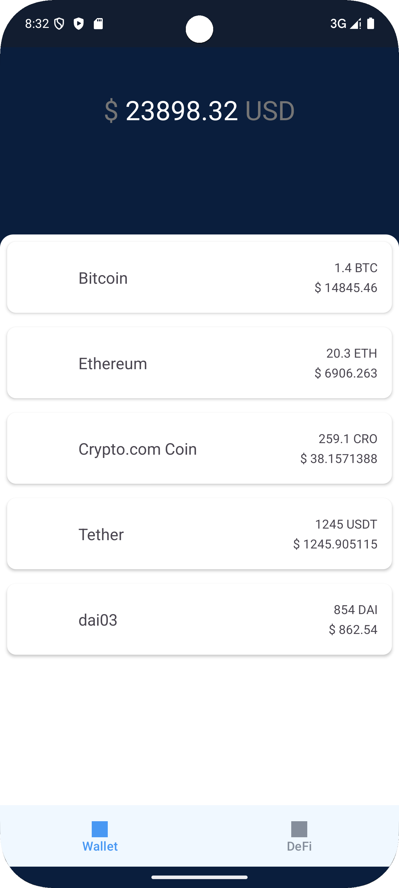

# Smart Wallet

Smart Wallet is an Android application designed to manage your cryptocurrency assets. It provides a clean and intuitive interface for viewing your token balances, exchange rates, and total asset value.

## Architecture

The application employs the following architectural patterns:

*   **MVVM (Model-View-ViewModel):** Separates UI logic from business logic.
*   **Data Flow:** Utilizes Kotlin Flow to handle asynchronous data streams.
*   **Unidirectional Data Flow:** Data flows from the ViewModel to the View.

## Directory Structure

**Directory Structure Description:**

*   **`app/`:** This is the root directory of the Android application module.
    *   **`src/main/`:** Contains the main source code and resource files of the application.
        *   **`java/`:** The Kotlin source code directory.
            *   **`com/wallet/app/`:** The application's package name.
                *   **`adapter/`:** Directory for storing RecyclerView adapters.
                    *   **`TokensAdapter.kt`:** Adapter for displaying the token list.
                *   **`entity/`:** Directory for storing data entity classes.
                    *   **`Balance.kt`:** Data class for token balances.
                    *   **`Currency.kt`:** Data class for token information.
                    *   **`Rate.kt`:** Data class for exchange rate information.
                *   **`fragment/`:** Directory for storing Fragments.
                    *   **`WalletFragment.kt`:** The main wallet screen Fragment.
                *   **`utils/`:** Directory for storing utility classes.
                    *   **`JsonHelper.kt`:** Utility class for parsing JSON data.
                *   **`vm/`:** Directory for storing ViewModels.
                    *   **`WalletViewModel.kt`:** The main wallet screen ViewModel.

## Sample Effect

## How to Run

1.  **Clone the Repository:**
    *   bash git clone https://github.com/lamer500/crypto. git
2.  **Import the Project:**
    *   Open Android Studio.
    *   Select "Open an existing Android Studio project."
    *   Choose the `Smart_Wallet` directory that you cloned.

3.  **Build and Run:**
    *   Click "Build" -> "Make Project."
    *   Click "Run" -> "Run 'app'."
    *   Select an emulator or connect an Android device.

---